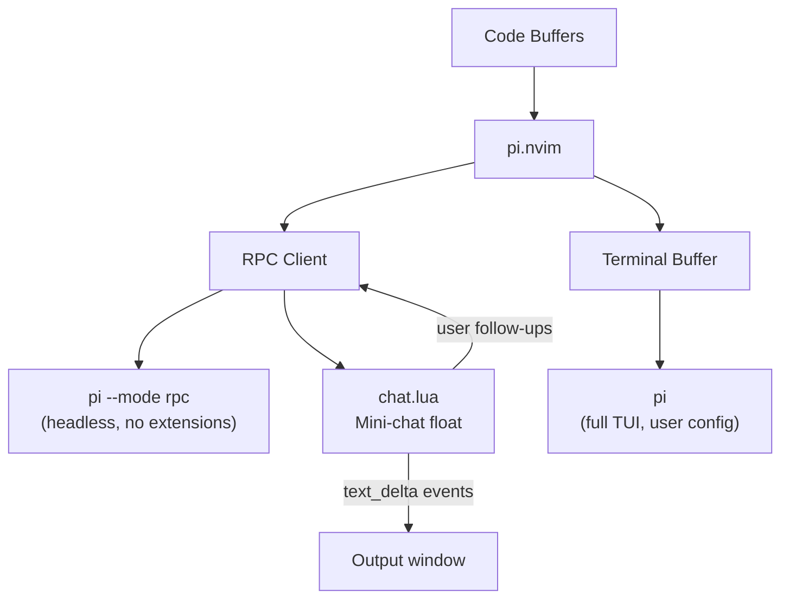

# pi.nvim

Neovim plugin for [Pi coding agent](https://github.com/badlogic/pi-mono). Two ways to use it:

1. **Terminal mode**: Pi's full interactive TUI in a split or float, with your editor feeding it context
2. **Quick actions**: Headless RPC calls for explain/review/free-prompt on visual selections, streamed into a mini-chat float

## Requirements

- Neovim 0.10+
- [Pi](https://github.com/badlogic/pi-mono) installed globally: `npm install -g @mariozechner/pi-coding-agent`

## Install

### lazy.nvim

```lua
{
  "PedroKlein/pi.nvim",
  cmd = { "Pi", "PiSend", "PiQuick", "PiModel", "PiThinking", "PiSession", "PiStop" },
  keys = {
    { "<leader>ao", desc = "Pi: Toggle terminal" },
    { "<leader>aO", desc = "Pi: Toggle terminal (float)" },
    { "<leader>as", desc = "Pi: Send to terminal", mode = { "n", "v" } },
    { "<leader>aq", desc = "Pi: Quick prompt", mode = "v" },
    { "<leader>ae", desc = "Pi: Explain", mode = "v" },
    { "<leader>av", desc = "Pi: Review", mode = "v" },
    { "<leader>am", desc = "Pi: Switch model" },
    { "<leader>ai", desc = "Pi: Session info" },
  },
  opts = {},
  config = function(_, opts)
    require("pi").setup(opts)
  end,
}
```

### Local development

```lua
{
  dir = "~/Dev/github.com/PedroKlein/pi.nvim/main",
  opts = {},
  config = function(_, opts)
    require("pi").setup(opts)
  end,
}
```

## Keymaps

All keymaps use `<leader>a` (AI prefix).

| Key | Mode | What it does |
|-----|------|--------------|
| `<leader>ao` | n | Toggle Pi terminal (split) |
| `<leader>aO` | n | Toggle Pi terminal (float) |
| `<leader>as` | v | Ask for prompt, send selection + file:lines to terminal |
| `<leader>as` | n | Ask for prompt, send @file reference to terminal |
| `<leader>ae` | v | Explain selection (opens mini-chat) |
| `<leader>av` | v | Review selection (opens mini-chat) |
| `<leader>aq` | v | Free prompt on selection (opens mini-chat) |
| `<leader>am` | n | Switch RPC model |
| `<leader>ai` | n | Session info |

## Mini-chat

Quick actions (explain, review, free prompt) open an ephemeral two-window float:

```
┌─────────────── Explain ──────────────────┐
│ ❯ read: lua/pi/rpc.lua                   │
│ ❯ grep: prompt_stream                    │
│                                          │
│ This function creates a streaming handle │
│ that subscribes to RPC events...         │
│                                          │
│ (you can scroll, yank, search here)      │
└──────────────────────────────────────────┘
┌─── Input ────────────────────────────────┐
│ what about error handling?               │
└──────────────────────────────────────────┘
```

The output window is readonly. You navigate it with normal vim motions (j/k, /, y, G). The input window is where you type follow-up questions.

**Navigation:**

| Key | Where | Action |
|-----|-------|--------|
| `<Tab>` | either | Toggle focus between output and input |
| `i` / `a` | output | Jump to input in insert mode |
| `<Esc>` | input (insert) | Go back to output in normal mode |
| `<CR>` | input | Send follow-up message |
| `<C-c>` | either | Abort current stream |
| `q` | either (normal) | Close the chat |

Each time you open a quick action, it starts a fresh conversation. Pi uses its built-in tools (read, grep, ls) to explore the codebase before answering, so you'll see tool calls appear as they happen.

## Terminal mode

`:Pi` opens Pi's full interactive TUI in a split. This is a persistent session with your normal Pi configuration (model, extensions, skills, everything). Use `<leader>as` to send context from your editor into it.

When inside the terminal buffer:

| Key | Action |
|-----|--------|
| `<Esc><Esc>` | Exit terminal mode |
| `<leader>ao` | Hide terminal |
| `<C-h/j/k/l>` | Navigate to adjacent windows |

## Commands

| Command | Description |
|---------|-------------|
| `:Pi` | Toggle terminal |
| `:PiSend <msg>` | Send message (with optional visual selection) to terminal |
| `:'<,'>PiQuick [action]` | Quick action on selection |
| `:PiModel` | Pick model for RPC |
| `:PiThinking` | Pick thinking level for RPC |
| `:PiSession [info\|new\|stats]` | Session management |
| `:PiStop` | Kill all Pi processes |

## Configuration

```lua
require("pi").setup({
  -- Terminal split direction
  split = "vertical", -- "vertical", "horizontal", or "float"
  split_size = 0.4,

  -- Float window options (for terminal float mode)
  float_opts = {
    width = 0.8,
    height = 0.8,
    border = "rounded",
  },

  -- RPC model (only affects quick actions, not terminal)
  model = nil, -- e.g. "anthropic/claude-sonnet-4-20250514"
  thinking = "medium",

  -- Pi binary
  pi_cmd = "pi",

  -- Flags for the RPC process (quick actions only)
  rpc_flags = {
    "--no-session",
    "--no-extensions",
    "--no-skills",
    "--no-prompt-templates",
    "--no-themes",
  },

  -- Extra args for the terminal process
  terminal_args = {},

  -- Start RPC process on plugin load for instant first action
  prewarm = true,

  -- Auto-reload buffers when Pi edits files
  auto_reload = true,

  -- Override or add actions
  actions = {
    explain = { prompt = "...", desc = "Explain selection" },
    review = { prompt = "...", desc = "Review selection" },
  },

  -- Keymap overrides (set to false to disable)
  keymaps = {
    toggle = "<leader>ao",
    toggle_float = "<leader>aO",
    send = "<leader>as",
    quick = "<leader>aq",
    explain = "<leader>ae",
    review = "<leader>av",
    model = "<leader>am",
    session = "<leader>ai",
  },
})
```

## Architecture



The RPC process is pre-warmed on plugin load and stays alive for the session. It runs with minimal flags for speed: no extensions, no skills, no prompt templates. Pi's built-in tools (read, grep, bash) remain available so it can explore context before answering.

The terminal process runs plain `pi` with your full configuration. It's a persistent interactive session.

## License

MIT
